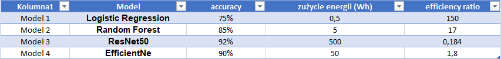
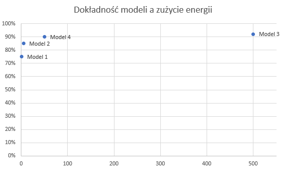
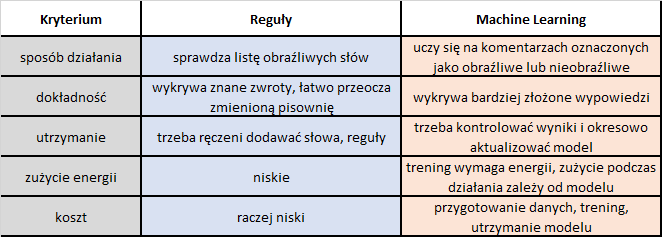

# Zadania średnie (9-12)

## Zadanie 9 - System rekomendacji filmów

### 1. Architektura systemu rekomendacji filmów

System będzie tworzył osobny ranking filmów dla każdego użytkownika, od najbardziej do najmniej dopasowanych
do jego zainteresowań. W bazie danych będą przechowywane:

- wiek użytkowników i ich preferencje,
- gatunek filmu, jego długość, kategoria, 
- historia oglądania, czas oglądania.

Przed treningiem modelu dane zostaną przygotowane: usuniemy duplikaty i obsłużymy brakujące wartości.
Po wejściu na platformę użytkownik zobaczy 10 filmów najlepiej dopasowanych do jego zainteresowań.
System pominie filmy, które już obejrzał.
    
### 2. Uzasadnienie decyzji technicznych

Wybrałbym ranking, ponieważ celem jest uporządkowanie filmów według dopasowania do konkretnego użytkownika.
Zastosowałbym supervised learning, wykorzystując informację, jaką część filmu (procentowo) obejrzał użytkownik,
aby przewidywać jego zainteresowania. Danymi wejściowymi byłyby informacje o użytkowniku i filmie,
a wartością przewidywaną — procent obejrzanego filmu. Na podstawie procentowego czasu oglądania powstałby ranking.

Do oceny jakości zastosowałbym odsetek obejrzanych rekomendacji. Za obejrzaną rekomendację uznałbym film,
którego użytkownik obejrzał przynajmniej połowę w ciągu 7 dni od wyświetlenia propozycji.
Jeśli z 10 poleconych filmów obejrzy 3, wynik wyniesie 30%.

### 3. Plan optymalizacji energetycznej — Green AI

Aby ograniczyć zużycie energii:

- zacząłbym od prostego modelu. Jeśli rekomendacje byłyby mało trafne, przetestowałbym bardziej złożony model,
- podczas testowania użyłbym próbki danych, ale uwzględniając gusta różnych użytkowników,
- wykorzystałbym już wytrenowany model. Dzięki temu nie musiałbym trenować go od zera,
- trenowałbym model np. raz w miesiącu.

Porównywałbym jakość rekomendacji oraz zużycie energii poszczególnych rozwiązań i wybrałbym rozwiązanie,
które zapewnia wystarczającą jakość przy mniejszym zużyciu zasobów.

## Zadanie 10 - Analiza trade-off: dokładność vs energia

- Model 1 warto wybrać gdy najważniejsze jest małe zużycie energii, a dokładnośc 75% jest wystarczająca. 
Ten model nada się dla aplikacji mobilnej, gdyż nie będzie prądożerny.
Ważne żeby sprawdzić jak szybko ten model będzie działać na telefonie.
- Model 2 wybierzemy gdy potrzebujemy większej dokładności, ale nadal chcemy utrzymać niskie zużycie energii.
- Model 3 prezentuje najwyższą dokładność i ten bym wybrał dla elektrowni jądrowej. Jeśli faktycznei wykrywa zagrożenia 
to zużycie tak duże energii jest uzasadnione.
- Model 4 to dobry wybór jeśli wysoka dokładnośc ma znaczenie, a dość duże zużycie energii jest na akceptowalnym poziomie,
choc i tak 10 razy mniejsze niż w Modelu 3 (przy różnicy 2 punktów procentowych dla dokładności)

## Zadanie 11 - Design case: wykrywanie fraudu

### Dokument z architekturą rozwiązania

- Wykrywanie fraudu to model klasyfikacji binarnej (dwie klasy: transakcja uczciwa / transakcja oszukańcza).
System wykorzystuje kwotę, lokalizację, czas typ sklepu czy historię klienta.
- Zastosowałbym Supervised Learning. Model uczyłby się z danych oznaczonych, historycznych, czy transkacje były uczciwe
czy oszukańcze.
- Model oblicza ryzyko i po przekroczeniu pewnego ustalonego progu dana transakcja trafia na listę transakcji
podejrzanych - wymagana jest dodatkowa weryfikacja albo konsultant łączy się telefonicznie z klientem.

### Analiza wyzwań i sposobów ich rozwiązania

- Problemem jest zbyt duża rozbieżność w obu klasach (99,9% do 0,1%). Sugerowałbym zmniejszenie liczby transakcji
uczciwych, gdyż na ten moment model mógłby wszystkie transakcje traktować jako uczciwe (zmniejszyć odsetek uczciwych
do nieuczciwych). 
- Można nadać większe wagi transakcjom nieuczciwym

Do oceny mdelu nie wystarczy samo accuracy - dokładność. Do oceny modelu użyłbym recall i precision. Recall pokazuje,
ile prawdziwych oszustw model wykrył. Precision zaś pokazuje, ile zgłoszonych alarmów faktycznie dotyczyło oszustw. 
Chciałbym eliminować fałszywe alarmy dla uczciwych klientów, ale zarazem wykrywać więcej oszustw.

10 milionów transakcji to dużo więc zacząłbym od prostego modelu, aby eliminować duże zużycie energii.
Dopiero bardziej złożony model mógłbym stosować w przypadkach podejrzanych.

## Zadanie 12 - Comparison: reguły vs ML

- Reguły: program sprawdza, czy komentarz zawiera słowa lub zwroty z ustalonej listy. Jeśli tak, oznacza komentarz
jako podejrzany.
- ML: model uczy się na komentarzach oznaczonych jako obraźliwe lub nieobraźliwe, a następnie klasyfikuje nowe komentarze.

Wybrałbym Machine Learning, ponieważ może wykrywać obraźliwe wypowiedzi, których nie ma na liście zakazanych zwrotów.
Początkowo wymaga przygotowania danych i treningu, a później kontroli wyników oraz aktualizacji.
Można połączyć obie metody: reguły sprawdzałyby znane obraźliwe zwroty, a model ML analizowałby pozostałe komentarze.
Niepewne przypadki trafiałyby do moderatora