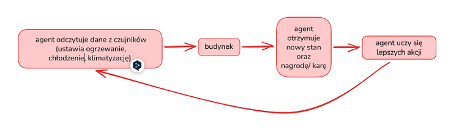
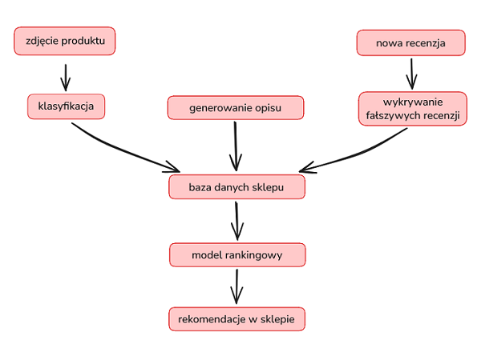
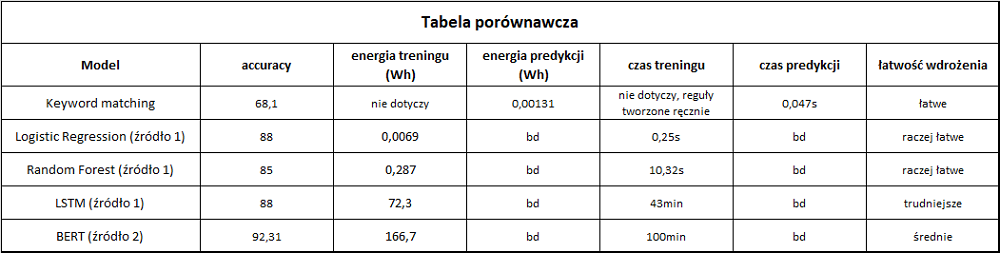
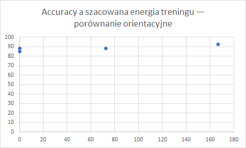

# Zadania trudne (13-20)

## Zadanie 13 - Design end-to-end: Smart City Traffic

### 1. Kompleksowy dokument projektowy

Celem systemu jest dobieranie czasu działania sygnalizacji świetlnej do natężenia ruchu.
Dzięki temu samochody powinny krócej czekać na skrzyżowaniach, a synchronizacja powinna sprawić,
że rzadziej będą się zatrzymywać, a co za tym idzie mniej emitować CO₂.

Do zaprojektowania systemu potrzebuję:
- liczby pojazdów przejeżdżających przez poszczególne skrzyżowania,
- długości kolejek,
- czasu oczekiwania na zielone światło,
- aktualnych ustawień sygnalizacji,
- informacji o godzinach szczytu,
- danych o rodzaju paliwa i średnim spalaniu pojazdów, które pomogą oszacować emisję CO₂,
- rankingu skrzyżowań z najwięyszmi korkami.

Zastosowałbym regresję do przewidywania liczby pojazdów na skrzyżowaniu za 15 minut czy przewidywanego czasu
oczekiwania. Regresja mogłaby również posłużyć do oszacowania emisji CO2. Klasyfikacja określałaby poziomu zatłoczenia:
małe, średnie, duże.

Jako podejście do uczenia wykorzystałbym supervised learning, ucząc model na danych historycznych np. na podstawie
danej pory dnia model przewidywałby liczbę aut za 15 minut na danym skrzyżowaniu. Etykietą byłaby rzeczywista liczba
pojazdów odnotowana po tym czasie. Unsupervised learning mogłoby pomóc znaleźć grupy skrzyżowań o podobnym  zatłoczeniu
o danej porze dnia.

System zbierałby dane i przewidywał natężenie ruchu, dobierałby długość zielonego światła dla poszczególnych kierunków, 
ale z uwzględnieniem kolejnych skrzyżowań (żeby nie powstawały korki w innych miejscach)

Najważniejsze ryzyka to błędne pomiary, awarie czujników i niewłaściwe ustawienia świateł. W przypadku awarii system powinien wracać do standardowego programu sygnalizacji.
Poprawa ruchu samochodów nie powinna odbywać się kosztem nadmiernego czasu oczekiwania pieszych.

### 2. Diagram przepływu danych:

czujnik, kamery → dane o natężeniu ruchu → model ML → sterowanie sygnalizacją świetlną

### 3. Metryki bizensowe i techniczne

Biznesowe:
- średni czas oczekiwania na zielone świałto (s)
- średnia długość kolejki
- szacowana emisja CO2

Techniczne:
- błąd przewidywania liczby aut
- zużycie energii

### 4. Analiza wpływu środowiskowego i Green AI

Płynniejszy ruch może ograniczyć zużycie paliwa oraz emisję CO₂. Efekt oszacowałbym na podstawie czasu postoju
i liczby zatrzymań. Najpierw sprawdziłbym prosty model i porównał go z bardziej złożonym rozwiązaniem.
Wybrałbym ten, który zapewnia wystarczającą skuteczność przy możliwie małym zużyciu energii.
Model trenowałbym w przypadku pogorszenia prognoz.

## Zadanie 14 - Semi-Supervised Strategy

### 1. Plan projektu semi-supervised learning
Celem projektu jest nauczenie modelu rozpoznawania produktów na zdjęciach. Dzięki temu nie trzeba będzie ręcznie
przypisywać kategorii do każdego zdjęcia.

Jako podejście do uczenia maszynowego zastosuję klasyfikację zdjęć:
- z 1000 opisanych zdjęć wykorzystam 800 do uczenia modelu,
- pozostałe 200 wykorzystam do sprawdzenia jego skuteczności,
- następnie model przewidzi kategorie dla kolejnych np. 20000 nieopisanych zdjęć,
- wybiorę zdjęcia, dla których model przewidzi kategorię z wysoką pewnością np. conajmniej 95%,
- wykorzystam te zdjęcia raze z kategoriami nadanymi przez model do dalszego uczenia,
- ponownie nauczę model na 800 opisanych zdjęciach oraz wybranych nowych zdjęciach,
- powtórzę ten proces dla kolejnych partii niopisanych zdjęć.

Model może się pomylić nawet przy wysokiej pewności, dlatego część wybranych zdjęć sprawdzę ręcznie. 

Porównanie wyników:
- pierwszy model nauczę na 800 zdjęciach, a sprawdzę na 200. Skutecznośc modelu określę na podstawie procentu zdjęć,
które rozpoznał poprawnie np. 90%,
- drugi model będzie się uczył na tych samych 800 zdjęciach i przewidywał kategorie dla kolejnych 20000 nieopisanych
zdjęć. Następnie dodatkowo nauczę go na wybranych zdjęciach, którym przypisał kategorię z wysoką pewnością. Sprawdzę
go na tych samych 200 zdjęciach testowych. Jeśli uzyska np 94% to będzie poprawa o 4 punkty procentowe.

### 2. Porównanie z alternatywami

1. Supervised Learning - model uczy się tylko na 800 opisanych zdjęciach. Jego skuteczność sprawdzę na pozostałych 200. 
Następnie przypisze kategorie do 99000 nieopisanych zdjęć bez dodatkowego treningu. Skuteczność może być niższa
niż w podejściu semi-supervised. 
2. Ręczne przypisanie kategorii do wszystkich zdjęć - nie wymaga modelu, ale zajmie bardzo dużo czasu. Człowiek również
może się pomylić. Tak opisane zdjęcia można później wykorzystać do uczenia modelu rozpoznawania nowych produktów.
3. Semi-supervised learning - pozwoli wykorzystać nieopisane zdjęcia do dalszego uczenia bez ręcznego przypisywania
kategorii do każdego z nich. Wymaga dodatkwowego treningu. To podejście może poprawić skuteczność dzięki większej
liczbie przykładów do nauki. Trzeba jednak uważać na będne kategorie nadane przez model.

### 3. Analiza ROI (Return on Investment) (dokładność/ koszt/ energia)

Sprawdzę, czy poprawa skuteczności modelu (np. z 90% na 94%) jest warta dodatkowego czasu uczenia i zużycia energii.
Korzyścią będzie mniej ręcznego opisywania zdjęć, co pozwoli zaoszczędzić czas i pieniądze. Porównam też zużycie
energii z uczeniem modelu na wszystkich ręcznie opisanych zdjęciach.

Do oszacowania energii przyjmę przykłądowo, że trening na pełnym zbiorze 100000 opisanych zdjęć zużyłby 10kWh.
Jeśli moje podejście, razem z przewidywaniem kategorii i dodatkowym uczeniem zużyje 7 kWh, oszczędność wyniesie 
3kWh, czyli 30%. Jeśli osczędność okaże się nawet mniejsza, to może być to opłacalne  dzięki ograniczeniu ręcznej pracy.

W porównaniu ze zwykłym supervised learning moje podejście wymaga więcej obliczeń i zużywa więcej prądu, 
ponieważ model dodatkowo się uczy. Oba podejścia przewidują kategorie dla 99 000 zdjęć, ale tylko semi-supervised
wykorzystuje wybrane zdjęcia do dalszej nauki. Jeśli skuteczność wzrośnie np. z 90% do 94%, ocenię, czy ta poprawa 
jest warta dodatkowych kosztów.

## Zadanie 15 - Reinforcement Learning Design

### 1. Formalny opis problemu RL

Celem jest ograniczenie zużycia energii w budynku, przy zachowaniu komfortu mieszkańców. Agent będzie sterował
ogrzewaniem, klimatyzacją i wentylacją klatek schodowych.

Środowisko to budynek. Agent podejmuje decyzje na podstawie:
- tempertaury na zewnątrz i wewnątrz,
- pory dnia i roku,
- obecności ludzi,
- jakości powietrza.

Akcje agenta:
- zwiększenie, znmiejszenie lub wyłączenie ogrzewania,
- zwiększneie, zmniejszenie lub wyłączenie chłodzenia,
- zwiększenie lub zmniejszenie wentylacji.

Czujniki i regulatory mogą sterować zarówno ogrzewaniem, jak i wentylacją. Zastosowanie modelu ML nie musi przynieść
dodatkowych korzyści. Agent może jednak nauczyć się, kiedy i jak mocno ogrzewać, uwzględniajac pogodę, obecność ludzi
oraz szybkość nagrzewania i wychładzania budynku. To może być przewada modelu ML. Ostatczenie trzeba porównać zużycie
energii i komfort mieszkańców przy sterowaniu przez agneta oraz przy użyciu zwykłych regulatorów.

### 2. Diagram agent-environment loop

### 3. Funkcja nagrody (reward function)

Nagrody i kary:
- agent otrzymuje nagrodę za utrzymanie temperaturey w ustalonym zakresie  i odpowiedniej jakości powietrza,
- agent otrzymuej karę, gdy jest zbyt zimno, zbyt gorąco lub jakość powietrza jest zła,
- zużycie energii zmniesza nagrodę (większe zużycie = większy koszt).
- nagroda = nagroda za komfort - nagroda za brak komfortu - kara za zużycie energii

Dzięki temu agent ma utrzymywać komfort, zużywając możliwie mało energii.

### 4. Porównanie z podejściem supervised

Supervised learning można wykorzystać do sterowania na podstawie przykładów pokazujących, jak ustawić ogrzewanie
i wentylację w danych warunkach. Agent Reinforcement Learning uczy się na podstawie skutków własnych decyzji
oraz otrzymanych kar i nagród. Dzięki temu może dobierać ustawienia, utrzymując komfort i ograniczając zużycie
energii w dłuższym czasie.

Jeśli agent nadal będzie się uczyć, może dostosowywać się do zmian, np. szybszego wychładzania budynku lub spadku
sprawności ogrzewania. 

Nie wiemy, które podejście będzie lepsze. Oba trzeba porównać pod względem zużycia energii i komfortu miekszkańców.

## Zadanie 16 - Multi-Model System Design

### 1. Opis komponentów

Model będzie przypisywał zdjęcia produktów do ustalonych kategorii. Zastosuję klasyfikację i uczenie nadzorowane.
Do nauki wykorzystam zdjęcia z poprawnie przypisanymi kategoriami. Po nauczeniu model otrzyma nowe zdjęcia i przewidzi,
do której kategorii należy produkt

Do generowania opisów wykorzystam gotowy model językowy, bez dodatkowego treningu. Przekażę mu dane produktu
i instrukcję dotyczącą opisu. Jeśli wyniki będą niezadowalające, poprawię instrukcję lub dodam przykładowe opisy

Do rekomendowania produktów zastosuję model rankingowy, który będzie układał produkty od najbardziej do najmniej
dopasowanych do użytkownika. Wykorzysta jego preferencje oraz historię przeglądania i zakupów. Zastosuję uczenie
nadzorowane, w którym kliknięcia i zakupy będą sygnałami zainteresowania produktem.

Do wykrywania fałszywych recenzji zastosuję klasyfikację i uczenie nadzorowane. Model będzie uczył się na recenzjach
oznaczonych jako prawdziwe lub fałszywe

### 2. Diagram architektury

Współpraca komponentów:
- model klasyfikujący zdjęcia zapisuje kategorię produktu w bazie,
- model językowy korzysta z kategorii i pozostałych danych produktu, tworzy opis i zapisuje go w bazie,
- model rankingowy korzysta z danych produktów i historii użytkownika, żeby przygotować rekomendacje,
- model wykrywający fałszywe recenzje analizuje nowe opinie i oznacza podejrzane do sprawdzenia.

### 3. Analiza zużycia zasobów

Klasyfikację zdjęć można wykonać po dodaniu nowego zdjęcia. Zużycie zasobów będzie zależało od ilości nowych zdjęć. 

Generowanie opisów może wymagać dużo zasobów przy dużej liczbie produktów. Zużycie zależy od długości opisu. Gotowe
opisy zapiszę w bazie, aby nie generować ich ponownie.

Model rekomendacji może kosztować duże zużycie zasobów. Będzie często używany, ponieważ odpowiada za przygotowanie
propozycji dla wielu użytkowników.

Analiza recenzji będzie wykonywana rónież po dodaniu nowej opinii. Zużucie bedzie zależało od liczby opinii i
długości recenzji oraz wielkości modelu.

### 4. Plan optymalizacji

Na początek wykorzystałbym gotowe modele, a w razie potrzeby dostosowałbym je do swoich danych. Wybrałbym małe
modele, które zapewniają wystarczająco dobre wyniki. 

Monitorowałbym zużycie energii, czas działania i skuteczność modeli, aby sprawdzić, czy po wprowadzeniu oszczędności
nadal dają dobre wyniki.

## Zadanie 17 - Benchmark: Energy vs Accuracy

### 1. Tabela porównawcza

Porównam pięć podejść do klasyfikowania recenzji filmów jako pozytywne lub negatywne

Energię oszacowano przy umownym poborze mocy 100 W. Nie jest to pomiar zużycia sprzętu z publikacji. Czasy pochodzą 
z różnych eksperymentów, więc wartości służą jedynie orientacyjnemu porównaniu

### 2. Wykres accuracy vs energia

### 3. Rekomendacja

- Keyword matching — do prostych przypadków, gdy wystarczą ustalone słowa kluczowe i nie potrzebujemy wysokiej skuteczności.
- Logistic Regression — dobry punkt wyjścia, gdy zależy nam na skuteczności i niskim koszcie obliczeń.
- Random Forest — warto sprawdzić jako alternatywę, ale w przytoczonym eksperymencie miał niższą accuracy
i dłuższy trening niż Logistic Regression.
- LSTM — warto rozważyć, gdy kolejność słów jest istotna. W przytoczonym badaniu nie poprawił accuracy względem
Logistic Regression, mimo znacznie dłuższego treningu.
- BERT — gdy ważne jest rozpoznawanie kontekstu i możemy zaakceptować większe wymagania obliczeniowe.

### 4. Analiza efektywności Green AI
W przytoczonym badaniu Logistic Regression osiągnął taką samą accuracy jak LSTM, ale uczył się znacznie krócej.
Pokazuje to, że bardziej złożony model nie zawsze daje lepsze wyniki. Zacząłbym od prostszego rozwiązania,
a bardziej wymagające modele stosowałbym wtedy, gdy poprawa skuteczności uzasadnia dodatkowe obliczenia.

W wykorzystanych publikacjach brakowało danych o czasie i energii predykcji, dlatego tej części porównania 
nie udało się uzupełnić

### Źródła

1. [Sentiment Analysis Revisited](https://thesai.org/Downloads/Volume16No9/Paper_65-Sentiment_Analysis_Revisited_A_Multi_Metric_Comparative_Study.pdf)
2. [BERT: A Sentiment Analysis Odyssey](https://arxiv.org/pdf/2007.01127)

